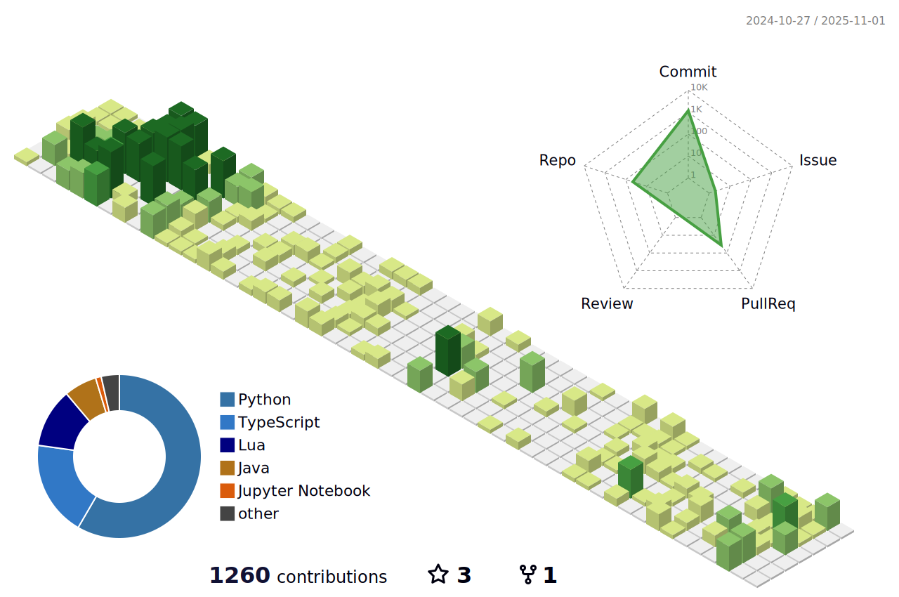

<!-- <p align="center"></p> -->

<!--START_SECTION:anmol-->


**🐱 My GitHub Data** 

> 📦 58.5 kB Used in GitHub's Storage 
 > 
> 🏆 31 Contributions in the Year 2026
 > 
> 🚫 Not Opted to Hire
 > 
> 📜 16 Public Repositories 
 > 
> 🔑 61 Private Repositories 
 > 

 Last Updated on 18/02/2026 19:05:50 UTC
<!--END_SECTION:anmol-->

<details>
  <summary>👨‍💻 Total time spent coding</summary>
  <!--START_SECTION:waka-->

```txt
TypeScript                         468 hrs 54 mins       ⣿⣿⣿⣿⣿⣿⣿⣿⣄⣀⣀⣀⣀⣀⣀⣀⣀⣀⣀⣀⣀⣀⣀⣀⣀   32.67 %
Other                              310 hrs 37 mins       ⣿⣿⣿⣿⣿⣤⣀⣀⣀⣀⣀⣀⣀⣀⣀⣀⣀⣀⣀⣀⣀⣀⣀⣀⣀   21.64 %
Java                               114 hrs 41 mins       ⣿⣿⣀⣀⣀⣀⣀⣀⣀⣀⣀⣀⣀⣀⣀⣀⣀⣀⣀⣀⣀⣀⣀⣀⣀   07.99 %
Kotlin                             74 hrs 33 mins        ⣿⣤⣀⣀⣀⣀⣀⣀⣀⣀⣀⣀⣀⣀⣀⣀⣀⣀⣀⣀⣀⣀⣀⣀⣀   05.19 %
Python                             70 hrs                ⣿⣄⣀⣀⣀⣀⣀⣀⣀⣀⣀⣀⣀⣀⣀⣀⣀⣀⣀⣀⣀⣀⣀⣀⣀   04.88 %
```

<!--END_SECTION:waka-->
</details>

---



<!-- vim: spelllang=en
